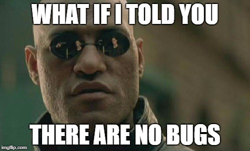
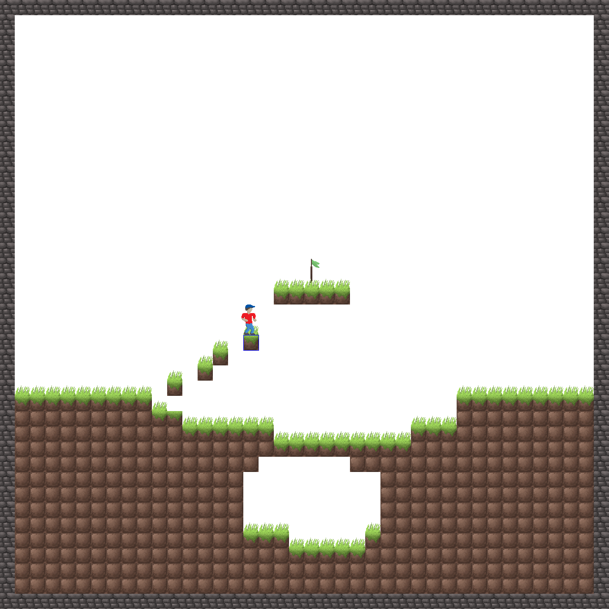
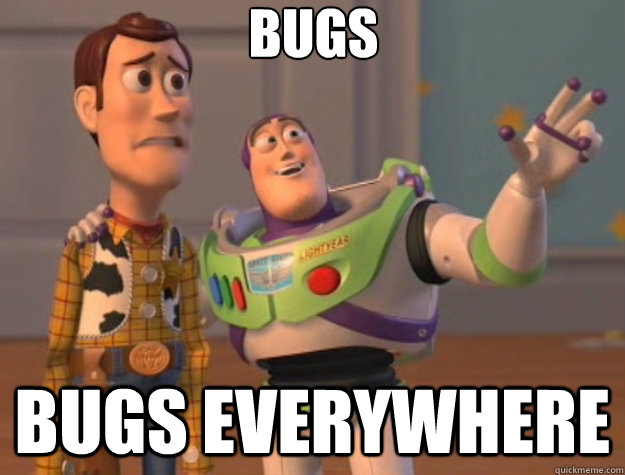

# Done
We are proud to announce our game 'get High' is now available for download [here] (http://get-high.ch/download.html)

`Tom Cinbis on 22.5`

# Final steps
With only three days left to the final milestone, we are mostly working on our documentation. The game manual is now up to date, as well as the documentation for the protocol. Also outlining the architecture of the game is a task we are currently working on.

In terms of code we cleaned up some of the classes, added documentation where needed, improved and fixed several issues.
To make the keybings more easily customizable, it is now possible to press a certain key which the client want's to assign to an action, and the respective key binding will be displayed in the field.

`Max Burgert on 19.5`

# How do I play?
To make our game more enjoyable to others, we can now proudly present a working tutorial. The tutorial is accessible in the Lobby Window under 'Help - Tutorial'. In the tutorial the player gets introduced to the basic game mechanics, as well as the goal of the game.

`Max Burgert on 16.5`

# Changing Key Bindings
Humans are  mutable and so we made a new feature that the client can change his key bindings in accordance with his preferences. In addition to that, we also worked on our tutorial and a splash screen when the game starts. 

Furthermore the map generator was changed, since the algorithm did not work properly when generating dirt and stone blocks, it either choosed one over the other. Now, below a surface of dirt blocks, chunks of stones - sometimes containing team blocks - are generated. Also some parts of the floating islands are now generated with stone, instead of beeing just made out of dirt blocks.

`Max Burgert on 13.5`

# Game Controller Support
The game is now playble with common game controllers. We therefore implemented the LWJGL3 library. Apart from that, to add diversity to the colors and graphics, newly player graphics are added and the team color is now choosed randomly
This game is now way more fun to play!

`Max Burgert on 11.5`

# Tutorial
Today we worked on the tutorial for our game. 
By selecting Help -> Tutorial in the Lobby Window, a client can now start playing our tutorial. This tutorial will give an oversight of the mechanics, rules and tricks in the game. Step by step the client is guided through the features. After a new feature is introduced, the client then can apply the newly learned to get to the next step. 

`Max Burgert on 08.5`

# More enhancements!
After we introduced the player camera and generated maps, we added a bunch of new features.

At first, a "minimap" was added. This map represents the current state of the whole map and is located on the top left corner on the screen. It could be a valuable part to keep oriented because the winning point and your current location, as well as all set and mined blocks are displayed.

Let me introduce you to a new blocktype, called teamblocks.
Each of the two teams has its own block, which is colored in the team color to be distinguished from the normal blocktypes. Those blocks can only be set and mined by their own teams. The most interesting part on this blocktype is, that it only counts for the respective teams as blocks, for the other team the block is the same as air. So if a player jumps on a teamblock of the enemy team, he will fall through.

We also enhanced our UI in the lobby, all chat commands where replaced by buttons and checkboxes.

`Max Burgert on 06.5`

# Player Camera And Generated Maps
In the last week, we did not only rework our ping and improved our gamecycle, we also worked on a player camera. A player camera is basically the viewpoint of the player which is fixed to the character. So if you move your character, the view will move in accordance to the character. Therefore, it is now possible to play the game with different resolutions in fullscreen which increases the game experience a lot!

We also made a first draft of a generator for our map. Since we are not longer bound to the screensize, greater maps are now possible which we need to fill with blocks.

`Max Burgert on 02.5`

# Ping and Pong - A story on it's own

We totally redesigned our Ping and Pong strategy, because it was kind of ugly and didn´t work correctly. Most of the time our Server decided to kick a client, pretty much random, even if the network connection was perfectly fine. Especially Paul’s laptop got kicked often, because the server didn’t like him.

We realized we had to do something against the racial profiling, our PCs suffered from. So that’s what we have done in the last past days. We thought about a neutral metric to determine which client has to be kicked… we decided to use the TIME, cause time doesn’t care about gender, race nor does it care about Intel® or AMD®. But does it work now?

YES! Our clients stay connected until they are supposed to disconnect and nobody feels discriminated anymore.

`Tom Cinbis on 27.4`

# Graphic Update

`Max Burgert on 25.4`
# UI changes and player camera

Since the presentation of milestone 3 we reworked our lobby window and added a player camera which does not show the full map size anymore, but a certain part around the playing character.

The picture sums up our goal for the upcoming week, which is to fix several bugs where the client disconnects when idle in chat window, during the game and after the game. We also want to improve updates of the player location in the game cycle, since rubberbanding sets in after a few minutes.

`Max Burgert on 25.4`

# Milestone 3, we are getting higher!
Yesterday we had our team meeting and reviewed the last week together. In our last blog entry we told you that we managed it to start a game and that there are progresses in our collision detection. We have now made big steps in the last week by optimizing our collision detection and collision handling which is now working totally fine.

Furthermore we now have a basic gamecycle so that the game is playable with more than one person in a really basic way. 

But thats not all, besides all the coding we also took care of the important documentation. We rewrote our software quality concept, documented and beautified our code and prepared the presentation for milestone 3 what will be the next exciting event these days we are looking forward to!

`Tim Königl on 19.4`

# Ready up!
The game lobby is in its final steps as it now provides the function to start, end and open a game. When all clients in a game lobby have pressed the ready button, the game will start automatically.
We also made changes to the logout handling for the server and client side, which fixes a bug where the client closed the window but was not properly logged off. 

Thanks to easter, we will focus this week on a basic implementation of our game loop. 
In the last days, we also made progress in our game logic. The collision detection is working but far more important is the collision handling which gave us the possibility to a basic player control. 

`Max Burgert on 11.4`

# P stands for Progress
It is Tuesday again and we had our weekly team meeting where we discussed our further approach to milestone 3, presented and merged our progress on the goals which we agreed on last week. 

After hours of trying, Tom was able to get the CI function in gitlab running on last wednesday, which should play an important factor in our quality concept measurements. Since this was also a point of critique by the tutors on milestone 2, we will investigate till next tuesday in a more concrete way of measuring and where to measure software quality aspects.

A great step towards a working game engine was made by implementing fundamentals of our game logic by adding datatructures for the map, blocks, inventory and the player objects. 

The server is now able to manage multiple game lobbies and functions with which clients can create, join, leave and list game lobbies. Those informations are now displayed on the right hand side in the lobby window. Only members of the same game lobby will receive chat messages send from other clients who are part of the game lobby. If a client is not part of any game lobby, only clients who did not join a game lobby can read those chat messages. 

Broadcasting to all clients works along with storing a highscore list.

`Max Burgert on 4.4`

# Private love messages
Today we finished and implemented the whisper function in our lobby. It is now possible to send non-public messages to a specific client. These messages therefore will only be shown to the receiving and also to the sending client.

`Tim Königl on 29.03`

# Let's have a meeting
Today we agreed on a weekly two hour meeting on tuesdays, where we want to discuss our weekly goals and agreed on deadlines for certain tasks. We also want to review our code and keep it up with the software quality concept.

Till next Tuesday our aim is to implement the management of multiple gamelobbies on the server side and the manipulation (creation, joining, leaving) of a gamelobby on the client side. Further, first drafts of our gamelogic (datastructures) on which the basic game will be based on are due to the 4th of April. 

`Max Burgert on 28.03`

# No ping, no game
Yesterday we reworked our network protocol which is now based on enums instead of Strings. We implemented chat commands through which is now possible to change ones nickname. When closing the application, the client gets now properly logged off from the server and all client side background threads are closed. With ping/pong the server now checks if the client sends signs of a working connection, if he doesn't, the server will disconnect the client after three seconds from the server. In sight of milestone 2 we reviewed our code and documented as much as we could. Today, we want to descide on our code quality concept and document our protocol in a seperate file.

`Max Burgert on 24.03`

# Chatter like a magpie
A small step for mankind, a giant leap towards milestone 2! We now got a working chat between several clients with UI implementation. Earlier this week we fixed a problem where displaying the chat in the JavaFX textarea threw a NullPointerException. Besides that, we found out that a client who is still in the login window gets an error when other clients have already begun with chatting. This NullPointer was also fixed by initializing the listening from a client to the chatroom after he leaves the login window.

`by Max Burgert on 21.03`

# Protocol and LobbyUI touches 
We created a first draft of our network protocol and worked on the Login/Lobby UI which lets us test the server/client interaction in the upcoming days. Tom and Paul also worked on a basic server/client setup based on learned topics in the lecture. Basic communication between  server and at least two clients was tested.

`by Max Burgert on 16.03`

# Restructure & CI
After we tried to add Gradle to our project lot of errors appeard, we decided to create a new clean project in Intellij with Gradle support from the very beginning.
Now we can also add Continuous Integration to our repo.

`by Tom Cinbis on 15.03`

# First Steps
We discussed properties of our networkprotocol and outlined some commands that we definitely want to implement. In addition to that, we also started to create a first draft of our Login/Lobby GUI. This should be a fun week!

`by Max Burgert on 14.03`

# Finished presentation for milestone 1
Finished presentation for milestone 1 and pushed it.

`by Tom Cinbis on 01.03`

# Added all Members to repo
Now everybody joined our repo and we can start now.

`by Tom Cinbis on 01.03`

# Hello World
In future, you can read in this blog about our game. This is an example Blog entry and will be used similar in upcoming blog entries.

`by Max Burgert on 25.02`
